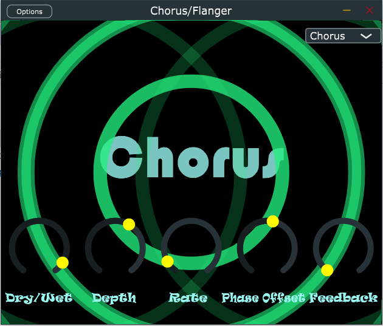
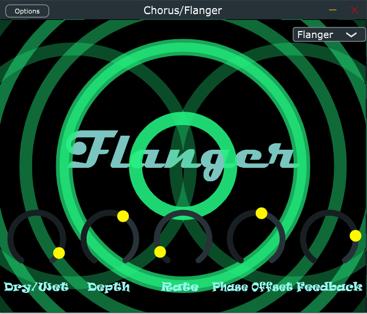

# Chorus-Flanger-Plugin
## Description
This plugin is designed for the purpose of manipulating an audio signal with the popular effects known as "Chorus" and "Flanger".

Both effects use a modulated delay to produce a detuned version of the input signal that is added together with the original signal at the output.

Created in C++ using the JUCE API, the plugin can be supported in all platforms and exported in formats such as VST3, AU, and AAX.

The plugin comes with a unique, animated GUI and offers the user control over parameters including Dry/Wet signal ratio, LFO modulation depth, LFO rate, phase offset (for stereo widening), and feedback.  The user is also able to select between a "Chorus" or "Flanger" effect from a drop-down menu.

## GUI
The GUI for this plugin includes animations that respond to the adjustment of the effect knobs, thus providing both audio and visual feedback to the user.

### Chorus

### Flanger

### Knob Effects on Animation
- **Dry/Wet**: Introduces animated ellipses to the screen

- **Depth**: Controls thickness of ellipses

- **Rate**: Controls the rate at which the ellipses are produced

- **Phase Offset**: Introduces ellipses at the left and right sides of screen

- **Feedback**: Adds more ellipses to simulate feedback

(*Refer to the PluginEditor.cpp file for code*)

## Algorithm

1. Read sample and any prior feedback from left and right input buffers into left and right delay buffers.
2. Increment write pointer.
3. Generate LFO based on current phase setting.
4. Update LFO phase setting for next sample block.
5. Map LFO value to milliseconds for Chorus or Flanger effect.
6. Calculate read head from delay buffers based on LFO value in milliseconds.
7. Read from delay buffers (interpolate between samples if necessary for high-precision reading).
8. Store delayed samples as feedback (amount determined by user control).
9. Send Dry/Wet signal mix to output buffers

The plugin also features parameter smoothing and linear interpolation in order to improve real-time audio quality and provide
accurate response to UI settings.

It is also able to save and load its state so that, when used in a DAW, the settings used when the file was last saved will
once again be available to the user.

(*Refer to the PluginProcessor.cpp file for code*)
